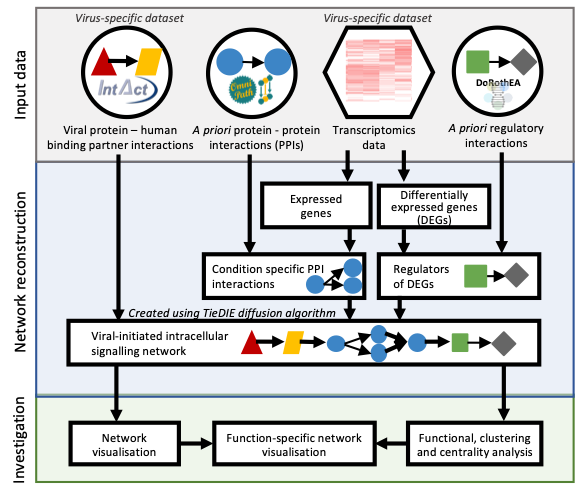

# ViralLink

## Overview

ViralLink is a systems biology workflow which reconstructs and analyses networks representing the effect of viral infection on specific human cell types.

These networks trace the flow of signal from intracellular viral proteins through their human binding proteins and downstream signalling pathways, ending with transcription factors regulating genes differentially expressed upon viral exposure. In this way, the workflow provides a mechanistic insight from previously identified knowledge of virally infected cells. By default, the workflow is set up to analyse the intracellular effects of SARS-CoV-2, requiring only transcriptomics counts data as input from the user: thus encouraging and enabling rapid multidisciplinary research. However, the wide ranging applicability and modularity of the workflow facilitates customisation of viral context, *a priori* interactions and analysis methods.

ViralLink is currently available as a series of R and Python scripts which can be run through two different methods:<br>
With docker: the whole pipeline and/or the separate stages can be run from within a docker container which negates the need for local Python and R installations making the pipeline easily accessible (recommended).<br>
Without docker: the whole pipeline (via a Python wrapper script) and/or the separate scripts can be run locally using local installations of Python and R with associated packages.


More detailed information about ViralLink is available in the following paper:

> Treveil A., Bohar B., Sudhakar P. et al. [ViralLink: An integrated workflow to investigate the effect of SARS-CoV-2 on intracellular signalling and regulatory pathways] https://doi.org/10.1101/2020.06.23.167254, _BioRxiv_, (2020)



----
## Getting Started

You can run the pipeline with or without a dockerisation. In both of the options, you can run the whole pipeline at once or you can run the different steps separately from each other.<br><br>
NOTE: The whole pipeline (with the example input data) needs around 8 GB of memory! But the memory allocation will vary on the input dataset. For example if you try to use it on a bigger dataset then they may require more memory!

### Dockerised pipeline

The dockerised pipeline requires only a few commands to run the whole analysis. Here you need to have Docker installed and working on your computer (docker version >=3). This is easily downloadable from the Docker website (www.docker.com). 

#### Running dockerised ViralLink

To use the dockerised ViralLink, download the ViralLink repository using the _Clone or download_ button on the Github web page or by typing the following into a terminal window:

```
cd folder/to/clone-into/
git clone git@github.com:korcsmarosgroup/ViralLink.git
```
Once the GitHub repository is successfully downloaded, then you need do the following within the command line terminal:
Go to the folder, where you downloaded the pipeline:
```
cd folder/to/clone-into/ViralLink
```
Type the following command into the terminal: this builds a docker image, starts a docker container and steps into this container (it will take time):
```
bash virallink.sh
```
If the above command successfully finished, you should see something like this:
```
root@3c172830ba15:/home/virallink#
```
After you got this prompt in your terminal, you can run the whole pipeline with the following command:
```
python3 virallink.py
```

The speed of the whole pipeline run is roughly between 2 and 2 ½ hours, but this will depend on the hardware which it is being run on.

If you want to run any steps separately from the others, you need to navigate into the scripts folder after you got your prompt inside the docker container: ```root@3c172830ba15:/home/virallink#```. Every step has its own readme file, which contains the information on how you can run the given step only. For example:
```
cd scripts/1_process_expression_data/
```

#### Debugging

* Upon running ‘bash virallink.sh’ an error such as the following means that docker is not installed on your computer:
```
virallink.sh: line 4: docker: command not found
```

* Upon running ‘bash virallink.sh’ an error such as the following means that the specified port is reserved. 
```
docker: Error response from daemon: Ports are not available: listen tcp 0.0.0.0:5900: bind: address already in use.
```
You should be able to get around this problem by opening the _virallink.sh file in a text editor and deleting the line where the reserved port is mentioned:
```
-p 5900:5900 \
```


### Non-dockerised pipeline

The pipeline can also be run using local installations of Python and R (with associated packages, see below for details), without the need for Docker.

#### Prerequisites

ViralLink should run on any UNIX system, and has been tested on Linux and Mac OS. Windows compatibility is not supported at this time - (use the Dockerised pipeline to run ViralLink on Windows).

**R (≥ 4.0.0)** and **Python 3** are required to run the workflow. Additionally, for clustering analysis and visualisation, **Cytoscape (≥ 7.0.0)** is required (AND IT MUST BE OPEN LOCALLY when the scripts are run - or these functions will be skipped).

Furthermore, the following packages are required:

> NB. The R packages should be installed automatically as part of the workflow, but it is advisable to pre-install them if you can. The Python packages must be pre-installed.

**R packages:**

```
tidyverse
org.Hs.eg.db
DESeq2
OmnipathR (needs "devtools")
RCy3 (≥ 2.6.0)
igraph
reshape2
naniar
clusterProfiler
ReactomePA
```

To install R packages, type the following into the terminal:

```
R
install.packages(c("BiocManager","tidyverse","devtools", "igraph","reshape2","naniar"))
require(devtools)
install_github('saezlab/OmnipathR')
BiocManager::install("RCy3","DESeq2","clusterProfiler","ReactomePA","org.Hs.eg.db")
quit()
```

**Python3 packages:**

```
scipy (≥ 0.12.0)
numpy (≥ 1.7)
networkx
distributions
```
To install Python3 packages, type the following into the terminal:

```
pip install numpy networkx scipy distributions
```

#### Running non-dockerised ViralLink

To use ViralLink, download the ViralLink repository using the _Clone or download_ button on the Github web page or by typing the following into a terminal window:

```
cd folder/to/clone-into/
git clone https://github.com/korcsmarosgroup/ViralLink
```

Make sure to navigate to the repository main directory before running the script. Do not change the folder structure or file names.

> NB. Ensure the *parameters.yml* file have been edited prior to running the script (unless you're running the example input data).<br>
> And do not forget to open Cytoscape locally!
>
```
*Open Cytoscape locally*
cd folder/to/clone-into/ViralLink/deploy/pipeline
python3 virallink.py
```

The speed of the workflow will depend on the specification of the computer. The most intensive parts are the tiedie.py script in step 3 and the functional analysis of step 6. It is likely to take between 30 minutes and a 2 hours to complete everything.

If you want to run any steps separately from the others, you need to navigate into the scripts folders. Every step has its own readme file, which contains the information on how you can run the given step only. For example:
```
cd folder/to/clone-into/ViralLink/deploy/pipeline/scripts/1_process_expression_data/
```

#### Debugging

* The wrapper outputs command line messages, warnings and errors to the file *virallink.out*. Open this in a text editor to try to identify issues with the workflow.

* Make sure that the *virallink.py* script is being run in Python 3 and from the main directory of the ViralLink repository. Make sure none of the folders or files have been renamed or moved.

* Ensure that the layout of the *parameters.yml* file and the parameter names have not been altered. Regarding the specified parameters, make sure that the file paths are reachable from the main directory of the ViralLink repository.

* The wrapper should install all required R packages, but this isn't always possible and can therefore cause errors running the workflow. Python packages must be pre-installed. Try to install all required packages (see section above) prior to running the wrapper.

* If you are missing *.cys* files or clustering results, make sure Cytoscape is open locally before running the workflow.

----

## Inputs to ViralLink

When running the workflow using the wrapper script (*virallink.py*), all input files and parameters should be specified by editing the *parameters.yml* file using a text editor. For description of these parameters, see the *parameters_description.tsv* file.
> NB.
> * Do not edit the parameter names in the *parameters.yml* file.
> * File paths can be relative and slashes are not required at the beginning and end of the paths.
> * The wrapper will run all scripts in step 1 -> step 6 inclusive. The only script not run is step 7, as it requires interpretation of the results for the purpose of selecting functions of interest to visualise.

If the user would like to run the scripts separately from the workflow wrapper, each script should be run from the command line, specifying the required input parameters. The parameters for each script can be found in the *scripts/parameters_all.tsv* file and in the script *readme.md* files.

**The input files for ViralLink are as follows:**

1. An unnormalised counts table from a human transcriptomics study. Genes (using gene symbols or UniProt protein IDs) as rows and samples as columns.  (REQUIRED FROM USER)

2. A tab-delimited two-column metadata table specifying test and control sample IDs in the following format. Here the sample names must match the headers in the normalised counts table. For an example metadata file see the *input_data* folder.  (REQUIRED FROM USER)


|   sample_name    |   condition  |
| ------------- | ------------- |
|   sample1    |   test   |
|   sample2    |   test   |
|   sample3    |   control    |

3. Viral - human protein-protein interaction table
  - Interactions for SARS-CoV-2 from [*Gordon et al.*](https://www.nature.com/articles/s41586-020-2286-9) provided: *input_files/sarscov2-human_ppis_gordon_april2020.txt*
  - Tab-delimited with one line per interaction
  - 2 columns named *viral_protein* and *human_protein*
  - An optional 3rd column named *sign* can contain either *+* or *-* to indicate an activator or an inhibitory interaction (respectively). If this column is not provided, all interactions are assumed to be inhibitory.
  - Human proteins in UniProt format
 
4. Gene symbol annotations for all input viral proteins, for ease of data interpretation.
  - Annotations for the Gordon *et al.* SARS-CoV-2 proteins provided: *input_files/sarscov2_protein_annotations.txt*
  - Tab-delimited with one line per protein
  - At least 2 columns named *Accession* and *gene_symbol*

5. Reactome annotations for all human UniProt IDs
  - Only required for the *filter_networks_by_functions.R* script (which is not part of the Python wrapper)
  - Provided based on data downloaded from Reactome on 30/04/2020: *input_files/reactome_annotations_uniprot_300420.txt*
  - Tab-delimited text file with 2 columns: uniprot id column "gene" and a column of Reactome pathway names separated by ";", named "reactome"
 
**Additional required parameters:**

1. Log2 fold change cut off
  - Genes must have log2 fold change more than or equal the modulus of this value to be differentially expressed
 
2. Adjusted p value cut off
  - Genes must have adjusted p value (from differential expression analysis) less than than or equal to this value to be differentially expressed
 
3. Type of ID in the input expression data
  -  Must be *symbol* (for gene symbols) or *uniprot* (for Uniprot IDs)

## Outputs of ViralLink

ViralLink outputs a number of different files. The most important are the final network and analysis results files:
1. **The reconstructed intracellular network:**
  - In edge table text format: *4_create_network/final_network.txt*
  - In Cytoscape format: *5_betweenness_and_cluster_analysis/causal_network.cys*
 
2. **Node annotations for each gene/protein in the network:**
  - Without betweenness centrality measures and cluster annotations: *4_create_network/node_table.txt*
  - With betweenness centrality measures and cluster annotations: *5_betweenness_and_cluster_analysis/node_table_betweenness_cluster.txt*
 
3. **Overrepresented functions/pathways:**
  - All related files output to the folder: *6_functional_analysis/*

----
## References

[*Gordon et al.*](https://www.nature.com/articles/s41586-020-2286-9):

> Gordon DE., Jang GM., Bouhaddou M., *et al.*. (2020). A SARS-CoV-2 protein interaction map reveals targets for drug repurposing, *Nature*, https://doi.org/10.1038/s41586-020-2286-9.

